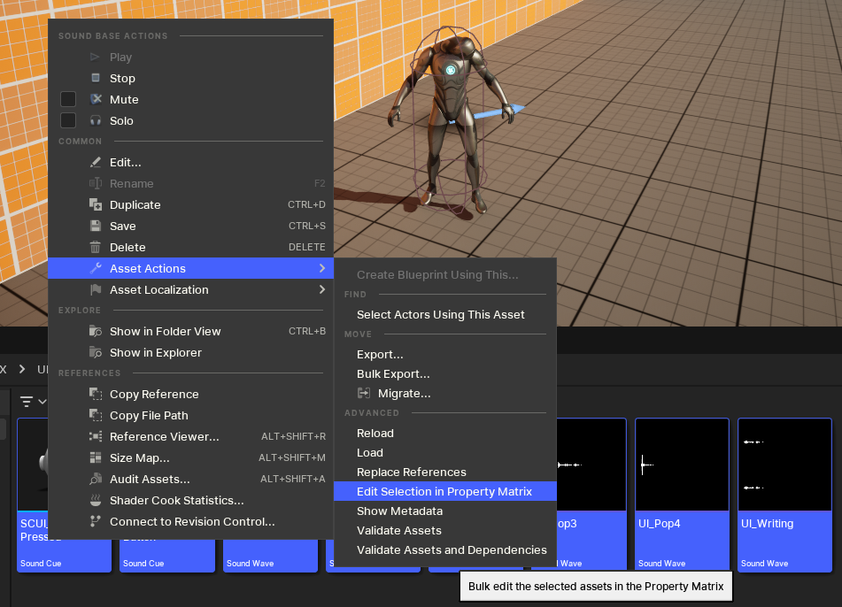
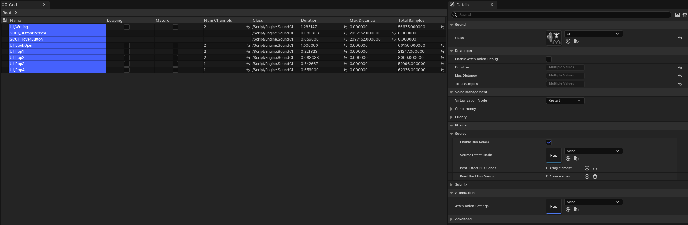

---
tags:
  - workflows
  - asset-actions
  - property-matrix
  - bulk
---
You are able to bulk edit assets in a matrix. This can be useful if you're, for example, assigning a common Sound Class to a lot of sounds and sound cues. Given that the search allows you to search across multiple folders, you it allows you to both view and assign missing properties.

