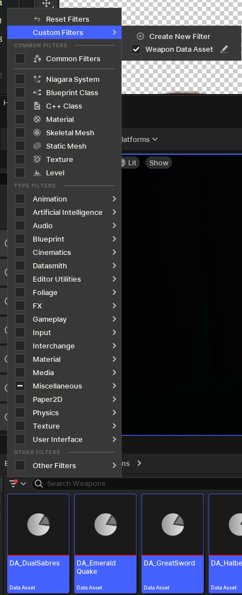
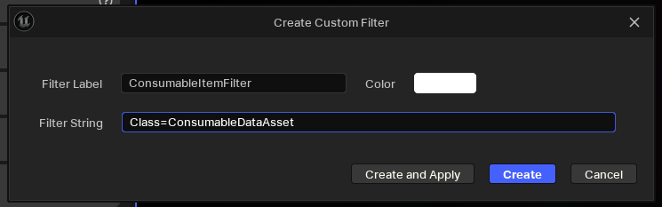

---
tags:
  - content-browser
  - asset-actions
---
# Custom Filters in Content Browser
You can create custom filters for your content browser to streamline asset editing. The following example shows how to create class filters:
1. Create a new custom filter by choosing "Create New Filter"
   
2. Give it a name, color and filter by the desired class

3. The filter now shows and you can [[Bulk Editing Assets in Property Matrix|Bulk Edit the Assets in a Property Matrix]], for example.