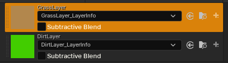
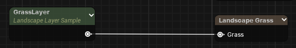
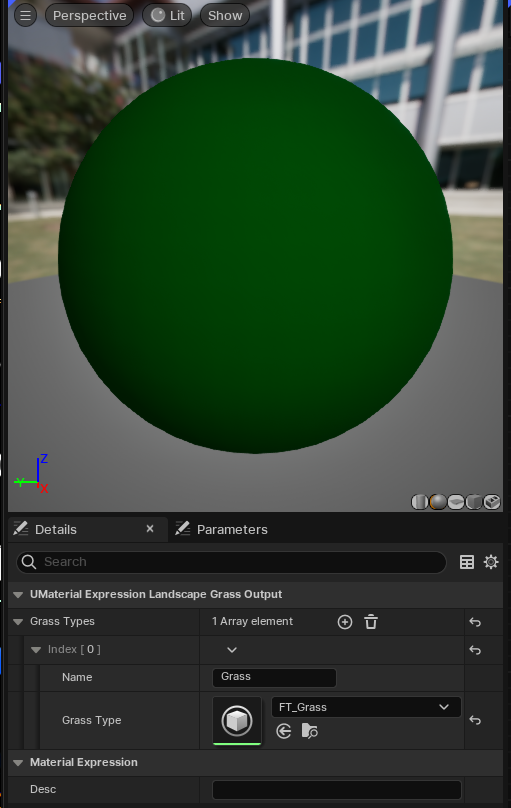
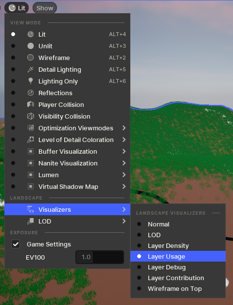

# Working with Landscapes
## Create Painting Layers and Assign Info
1. Layers can be created in the Editor "Landscape Mode"
	1. In "Edit Layers", Right click and "Create"
	2. Name your layer
2. In order to make it paintable, navigate to "Paint"
	1. If not visible, it means your material is not sampling from it
		1. Go to your material and add a "Landscape Layer Sample"
		2. Parameter Name should correspond to your layer name
3. Assign / Create terrain info
	1. Target Layers (in the Paint) section will have the layer to layerinfo associations
	2. If you have one, you can select it - otherwise click the "+" icon on the right side.
		
## Grass (via Landscape Grass Types)
To use grass via Landscape Grass types:
1. Create a Landscape Grass Type Asset
2. Assign appropriate values including the mesh
	
3. Sample from the grass layer into "Landscape Grass" node in your Landscape Material

## Visualize Paint Layer Usage
By default, you will simply see the color of the terrain unless your layer is configured otherwise. In order to visualize layer usage, you need to set the visualizer under the viewport:

