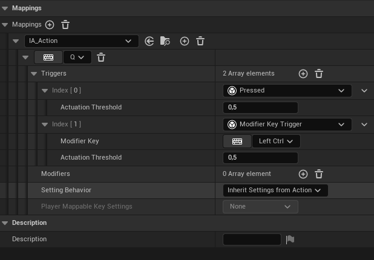

---
tags:
  - enhanced-input-system
  - input
  - modifier-keys
  - tutorials
---
It does not appear that modifier keys for actions are natively supported in the new [[Enhanced Input System]]. However, they are trivial to implement.


# C++
## ModifierKeyTrigger.h

```cpp
#pragma once

#include "CoreMinimal.h"
#include "InputTriggers.h"
#include "ModifierKeyTrigger.generated.h"

/**
 *
 */
UCLASS()
class PROJECT_API UModifierKeyTrigger : public UInputTrigger
{
	GENERATED_BODY()

public:
	UPROPERTY(EditAnywhere, Config, Category = "Trigger Settings")
	FKey ModifierKey = EKeys::LeftControl;

protected:
	virtual ETriggerType GetTriggerType_Implementation() const override { return ETriggerType::Implicit; }
	virtual ETriggerState UpdateState_Implementation(const UEnhancedPlayerInput* PlayerInput,
	                                                 FInputActionValue ModifiedValue, float DeltaTime) override;

#if WITH_EDITOR
	virtual void PostEditChangeProperty(FPropertyChangedEvent& PropertyChangedEvent) override;
#endif

};
```

## ModifierKeyTrigger.cpp
```cpp
#include "ModifierKeyTrigger.h"

#include "EnhancedPlayerInput.h"

ETriggerState UModifierKeyTrigger::UpdateState_Implementation(const UEnhancedPlayerInput* PlayerInput,
                                                                    FInputActionValue ModifiedValue, float DeltaTime)
{
	if (IsActuated(ModifiedValue) && PlayerInput->IsPressed(ModifierKey))
	{
		return ETriggerState::Triggered;
	}

	return ETriggerState::None;
}

#if WITH_EDITOR
void UModifierKeyTrigger::PostEditChangeProperty(FPropertyChangedEvent& PropertyChangedEvent)
{
	Super::PostEditChangeProperty(PropertyChangedEvent);

	if (PropertyChangedEvent.GetPropertyName().IsEqual(GET_MEMBER_NAME_CHECKED(UModifierKeyTrigger, ModifierKey)))
	{
		if (!ModifierKey.IsModifierKey())
		{
			ModifierKey = EKeys::LeftControl;
		}
	}
}
#endif
```
# Tutorials
[Modifier key triggers - Enhanced Input](https://dev.epicgames.com/community/learning/tutorials/vz52/unreal-engine-modifier-key-triggers-enhanced-input)
